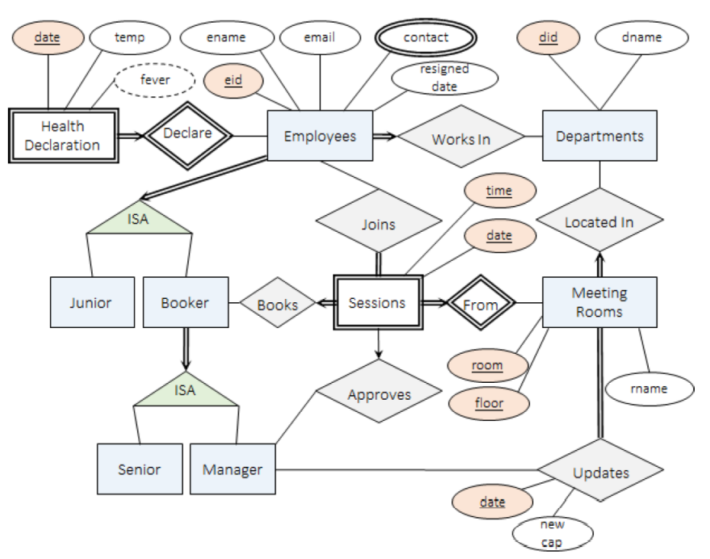

# Rooms-Booking-App-Postgresql-Project-

## Main Aim of the Project
The objective of the project is to develop a database application using PostgreSQL, which will be used by employees in a company to book meeting rooms. For in-depth details on the project requirements, please refer to the `Project Description.pdf` document. In addition, if you would like to know more about the code, please refer to the `Final Report.pdf` document.

## Requirements
- PostgreSQL (verion 12)

## Design (ER Diagram)

## Features List
- `add_department`: This routine is used to add a new department. The inputs to the routine are:
    - Department ID
    - Department name
- `remove_department`: This routine is used to remove a department. The inputs to the routine are:
    - Department ID

    **Note:** When a department is removed, we assume that all employees belonging to that department have been either (1) transferred to other department or
    (2) removed.
    
- `add_room`: This routine is used to add a new room. The inputs to the routine are:
    - Floor number
    - Room number
    - Room name
    - Room capacity

- `change_capacity`: This routine is used to change the capacity of the room. The inputs to the routine are:
    - Floor number
    - Room number
    - Capacity
    - Date

- `add_employee`: This routine is used to add a new employee. The inputs to the routine are:
    - Employee name
    - Employee contact number
    - Kind (junior, senior or manager)
    - Employee department

    **Note:** The unique employee ID and email address are automatically generated by the system.

- `remove_employee`: This routine is used to remove an employee. The inputs to the routine are:
    - Employee ID
    - Date (i.e., the last day of work, assumed to be in the past or today)
    
    **Note:** All past records should be kept intact while all future records should be removed in accordance with the project specification.

- `search_room`: This routine is used to search for available rooms. The inputs to the routine are:
    - Capacity
    - Date
    - Start hour
    - End hour

    The routine returns a table containing all meeting rooms that are available from the start hour (inclusive) to the end
    hour (exclusive). In other words, [start hour, end hour). The table returned includes:
    - Floor number
    - Room number
    - Department ID
    - Capacity
    
    The table is also sorted in ascending order of capacity (i.e., we do not want people to hog larger rooms first).

- `book_room`: This routine is used to book a given room. The inputs to the routine are:
    - Floor number
    - Room number
    - Date
    - Start hour
    - End hour
    - Employee ID

    The employee ID is the ID of the employee that is booking the room. If the booking is allowed (see the conditions necessary for this in `Project     Description.pdf` document), the routine will process the booking for people to join and for approval.
    
- `unbook_room`: This routine is used to remove booking of a given room. The inputs to the routine are:
    - Floor number
    - Room number
    - Date
    - Start hour
    - End hour
    - Employee ID
    
    The employee ID is the ID of the employee that is asking to remove the booking. If this is not the employee doing the booking, the employee is not allowed to remove booking (the no sabotage rule). If the booking is already approved, the booking will still get deleted. If there are already employees joining the meeting, they will be removed from the respective tables as well.

- `join_meeting`: This routine is used to join a booked meeting room. The inputs to the routine are:
    - Floor number
    - Room number
    - Date
    - Start hour
    - End hour
    - Employee ID

    The employee ID is the ID of the employee that is joining the booked meeting room. If the employee is allowed to join (see the conditions necessary for this in `Project Description.pdf` document), the routine will process the request. Since an approved meeting cannot have a change in participants, the employee is not allowed to join an approved meeting.
    
- `leave_meeting`: This routine is used to leave a booked meeting room. The inputs to the routine are:
    - Floor number
    - Room number
    - Date
    - Start hour
    - End hour
    - Employee ID

    The employee ID is the ID of the employee that is asking to leave the meeting. If this employee is not in the meeting in the first place, nothing will happen. Otherwise, the request will be processed. Since an approved meeting cannot have a change in participants, the employee is not allowed to leave an approved meeting.

- `approve_meeting`: This routine is used to approve a booking. The inputs to the routine are:
    - Floor number
    - Room number
    - Date
    - Start hour
    - End hour
    - Employee ID

    The employee ID is the ID of the manager that is approving the booking. If the approval is allowed (see the conditions necessary for this in `Project Description.pdf` document), the routine will process the approval.
    
- `declare_health`: This routine is used for daily declaration of temperature. The inputs to the routine are:
    - Employee ID
    - Date
    - Temperature

- `contact_tracing`: This routine is used for contact tracing. The inputs to the routine are:
    - Employee ID

    First, if the employee is not having a fever, then nothing happens. Otherwise, contact tracing is performed accordingly (see the necessary steps for this in `Project Description.pdf` document). The routine returns a table containing all employee ID that are in close contact with the given employee ID. The table returned include the following columns:
    - Employee ID

- `non_compliance`: This routine is used to find all employees that do not comply with the daily health declaration (i.e., to snitch). The inputs to the routine are:
    - Start date
    - End date

    The routine returns a table containing all employee ID that do not declare their temperature at least once from the start date (inclusive) to the end date (inclusive). In other words, [start date, end date]. The table returned include the following columns:
    - Employee ID
    - Number of days
    - Number of days is the number of days the employee did not declare their temperature within the given period. 
    
    The table is sorted in descending order of number of days.
    
- `view_booking_report`: This routine is to be used by employee to find all meeting rooms that are booked by the employee. The inputs to the routine include:
    - Start date
    - Employee ID
    The routine returns a table containing all meeting rooms that are booked by the given employee as well as its approval status from the given start date onwards. The table returned include the following columns:
    - Floor number
    - Room number
    - Date
    - Start hour
    - Is approved

    The table is sorted in ascending order of date and start hour.
    
- `view_future_meeting`: This routine is to be used by employee to find all future meetings this employee is going to have that are already approved. The inputs to the routine include:
    - Start date
    - Employee ID
    
    The routine returns a table containing all meetings that are already approved for which this employee is joining from the given start date onwards. The table returned include the following columns:
    - Floor number
    - Room number
    - Date
    - Start hour
    
    The table should be sorted in ascending order of date and start hour.
    
4. view_manager_report: This routine is to be used by manager to find all meeting rooms that require approval. The
inputs to the routine should minimally include:
Start date
Employee ID
If the employee ID does not belong to a manager, the routine returns an empty table. Otherwise, the routine
returns a table containing all meeting that are booked but not yet approved from the given start date onwards.
Note that the routine should only return all meeting in the room with the same department as the manager.
The table returned should minimally include the following columns:
Floor number
Room number
Date
Start hour
Employee ID
The table should be sorted in ascending order of date and start hour.
